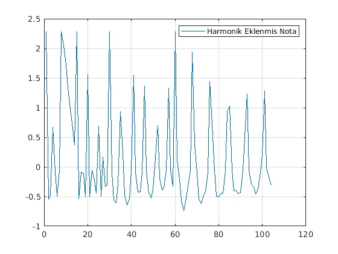

# Sinyal İşleme Proje Ödevi

 - Bu projede belirlenmiş bir melodinin müzik notalarının MuseScore programında yazılıp, MusicXML File (.musicxml) formatına dönüştürülerek  
  Matlab programı üzerinde tekrardan sentez edilmesi amaçlanmıştır. 
 - Proje içerisinde kullanılacak melodi olarak Hababam Sınıfı jenerik müziği ele alınmıştır.


## Ön Hazırlık
-------------

##### Harmonik Nedir?
 
- Harmonik kavramının temelinde Fourier Teoremi yatar. Fourier Teoremine göre Harmonik herhangi bir periyodik (kendini tekrar eden)  
dalga şeklini temel frekansındaki bileşen ve temel bileşeninin katlarındaki frekanslardaki bileşenlerin toplamı olarak tanımlanmaktadır.
- Harmonik sayısı 1 olarak verildiğinde harmonik olmayacaktır. 1' den büyük her n sayısı için (n-1) adet harmonik bulunacaktır.  
Harmoniklerin genlikleri 1/n olacaktır. Yani 2f frekansındaki ilk harmoniğin genliği 1/2, 3f frekansındaki 2. harmoniğin genliği 1/3 olacaktır. 

##### Zarf(Envelope) Nedir? 

- Zarflama işlemi en basit tanımıyla sesin hacimlendirilmesidir.  Başka bir deyişle ses seçilebilen bir zaman aralığında doğacak  
ulaştığı zirvede ne kadar kalacağı, ne zaman ve ne seviyeye kadar sönüme geçeceği ve tuş bırakıldığında ne kadar süre canlı kalacağını belirlemektir. 
- ADSR zarfı;  
  (A)ttack: Ses tuşe anında ne kadar sürede hangi hızla doygunluğa ulaşsın,  
  (D)ecay: Doyan ses (filtre ya da amplide iken) ne kadar süre asılı kalsın,  
  (S)ustain: Tanımlı asılı kalma süresi bitince hangi seviyede sabitlensin (düsşün),  
  (R)elease: Tuşu bıraktığında ne kadar sürede sönsün,  
 parametrelerinden oluşmaktadır.  
- Programımız da 2 tip zarf çeşidi bulunmaktadır.  
 ◦ Exponential zarf e^(−t/ölçü) şeklinde verilecektir. Ölçü notanın kaçlık olduğunu belirtir. Örneğin ½'lik bir nota için fonksiyon e^(−2t) olacaktır.  
 ◦ ADSR zarf tipi seçildiğinde Attack süresi %20 ve max değeri 1.5, Decay süresi %10,Sustain süresi %50 ve Release süresi %20 olmalıdır.  

## Fonksiyonlar
-------------
- Proje içerisinde 2 adet fonksiyon ve 1 adet script bulunmaktadır. Bunlar parseMusicXML.m, note.m ve sentez.m'dir.

##### parseMusicXML.m
-------------
- Melodiyi tekrar sentezleye bilmek için bize bazı parametreler gerekmektedir. Bunlar frekans, her bir notanın başlama ve bitiş süreleri  
her notanın ölçüsü vb. parametrelere ihtiyacımız vardır.
- Melodiyi oluşturma esnasında gereksinim duyduğumuz parametreleri (.musicxml) dosyasının parçalanmasıyla(parse) elde edilebilir.  
Bu parse işlemi için açık kaynak olarak sunulan parseMusicXML.m [fonksiyonunu](• https://gist.github.com/fabiozeh/62018d04ee9f507bf800d157e89c579f ) kullanacağız.
- Parse edilen melodiden x:19 boyutlarında matris oluşur. Bu matris içerisinde gerekli parametreler,  2., 4., 6. ve 7. sütunlarda bulunmaktadır.
	- 2 . sütun bize her bir notanın ölçü değerini ifade etmektedir.
	- 4 . sütun içinde bulunan her bir satır piano klavyesinden bir tuşa denk gelmektedir. 
	- 6 . ve 7. sütunlar ise her nota için süre değerlerini ifade edilmektedir. 6. sütun o anki notanın başlangıç değerini, 7. sütun ise başlangıç  
	değerinden itibaren geçen süreyi ifade etmektedir. Başka bir deyişle 6. sütün değerine 7. sütun değerini eklersek  
    bize notanın saniye cinsinden bitiş süresini vermektedir.

##### note.m
-------------
- Fonksiyon genel olarak piano klavyesindeki her bir tuşun rakamsal değerini frekans olarak geri döndürmektedir.
- Parse edilmiş olarak elimizde bulunan matris içerisindeki 4 sütunu note.m fonksiyonuna parametre olarak yollayarak, geri dönüş değeri olarak frekans elde edilmektedir.
- Klavyeden frekansa dönüştürmek için kullanacağımız fonksiyon,

> fm  =  2(m−69)/12(440 Hz)		[m, klavyedi tuşların rakamsal değeri.]

**Fonksiyon içerindeki m değerleri parse edilmiş matris de bulunan 4. sütun değerleridir.**

##### sentez.m
-------------
-  Şuana kadar elimizde parse edilmiş olarak matris ve her notanın ölçüsü, frekansı ve başlama-bitiş süreleri bulunmaktadır.
- sentez.m içerisin de her nota için bir sinyal oluşturup sonrasın da bu sinyallere sırasıyla harmonik, zarf ve eko işlemlerini uygulayacağız.  
- **sentez.m fonksiyonunun detaylı açıklaması kod üzerinden olacaktır.**

## SENTEZ.M DETAYLANDIRILMASI
-------------
- Frekans ve süre hesaplanması

```matlab
frekans = note(parse(i,4));
tt=0:fs:(parse(i,7));
/* zaman(tt) olarak her bir notanin 0' dan bitis degerine kadar olan sure kullanilmistir. 
Daha sonrasinda her bir nota uc uca eklenerek toplam sure elde edilecektir. */
```

- Sinyal oluşumu ve harmonik eklenmesi

```matlab
for j=1:harmonikSayisi
        notalar=notalar+(1/j)*cos(2*pi*j*frekans*tt);
end
/* Notanin sinyali ve harmonik ekleme islemi ayni anda yapilmaktadir.*/
```

- Zarf seçimi ve zarflama işlemi

```matlab
if zarfSecimi == 1
        A=linspace(0, 1.5, floor(length(tt)*0.2)); 
        D=linspace(1.5, 1, floor(length(tt)*0.1));
        S=ones(1, floor(length(tt)*0.5)); 
        R=linspace(1, 0, floor(length(tt)*0.2)); 
        zarfADSR = [A D S R];
        zarfliNota=zarfADSR.*notalar;
 elseif zarfSecimi == 0
        zarfExponential = exp(-tt/parse(i,2));
        zarfExponential = zarfExponential(1:end-1);
        zarfliNota=zarfExponential.*notalar;    
end
/* Proje genelinde iki farkli zarflama teknigi kullanilmaktadir. Bunlardan ilki ADSR ikincisi ise Exponential teknigidir.*/
/* Exponential tekniginde ki parse(i,2) degeri notanin kendi olcusunu ifade 
etmektedir./*
```
- Elde edilen sinyallerin uç uca eklenmesi

```matlab
calinanNota = [calinanNota zarfliNota];
```

- Sinyale son olarak eko eklenmesi ve çalınması

```matlab
calinanNotaTers=(calinanNota)';
reverb = reverberator('PreDelay',.15,'WetDryMix',.20)
echoNota = reverb(calinanNotaTers);
sound(echoNota,fs);
/*Proje içerisin de 2 farklı eko fonksiyonu kullanılmıştır.(conv&reverb)
```

- Hababam Sınıfı melodisinin 16. ölçüsü için aşağıda harmoniksiz, harmonikli ve eko eklenmiş şekilde grafikleri verilmiştir.

**NOT: Grafiklerin daha açıklayıcı şekilde gözükmesi için örnekleme frekansı düşük tutulmuştur. Grafikler üzerindeki sivri(türevsiz)  
alanlar göz ardı edilmelidir.**




## NORMALİZASYON (Peak Normalization)
-------------

 - Projede fark edileceği gibi sinyallere harmonik ekleme işlemi gerçekleştirdiğimiz de sinyallerin tepe(peak) değerleri artmaktadır.  
 Sinyalin ses dönüşme anında ani yükselmeler ve düşüşleri engellemek için sinyalimize bir normalizasyon işlemi uygulayacağız.

##### Normalizasyon Nedir? 

 - Bir sinyalin genliğini normalleştirmek, belirli bir kriteri yerine getirmek için genliği değiştirmektir.  
 Normalleştirme türlerinden biri, genliği, sinyalin en yüksek büyüklüğü belirtilen bir seviyeye eşit olacak şekilde değiştirmektir.
 - Matlab'da konvansiyonel olarak, bir ses sinyalinin genliği -1 ile +1 arasında değişebilir. Bu nedenle, bir sinyalin alabileceği  
 maksimum büyüklük 1'dir. Bu maksimum değer referans seviyesi olarak kullanılabilir.
 - Bir sinyalin tepe büyüklüğü 1 FS (0 dBFS) değerine normalleştirilebilir. Bu işlem, tüm değerlerin amplitüdünü, tepe büyüklüğü 1  
 değerine sahip olacak şekilde bir sinyale ölçeklendirme ile sağlanabilir.
 
```matlab
signalPeak = max(abs(calinanNota));
calinanNota = (1/signalPeak)*calinanNota;
```
 - Görüldüğü gibi sinyal değerlerinden tepe büyüklüğünü 1 değerine sahip olacak şekilde normalizasyon işlemi uygulanmıştır.
 


